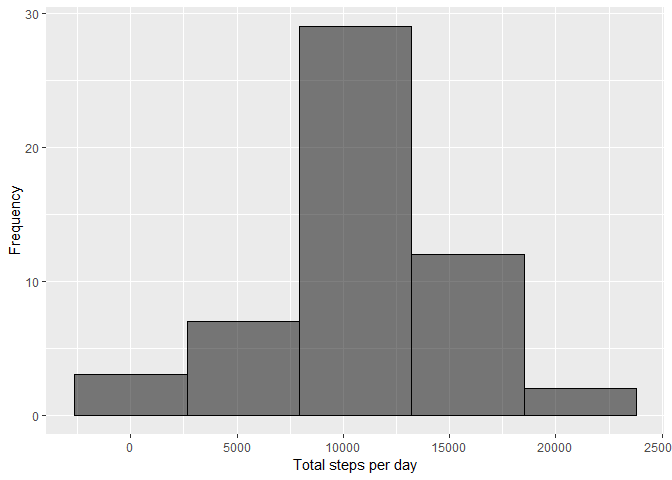
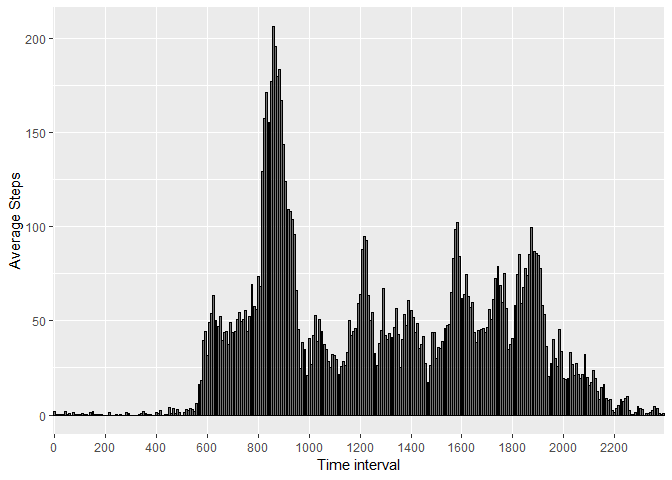
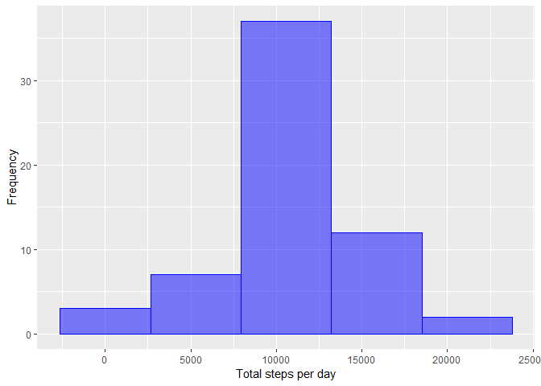
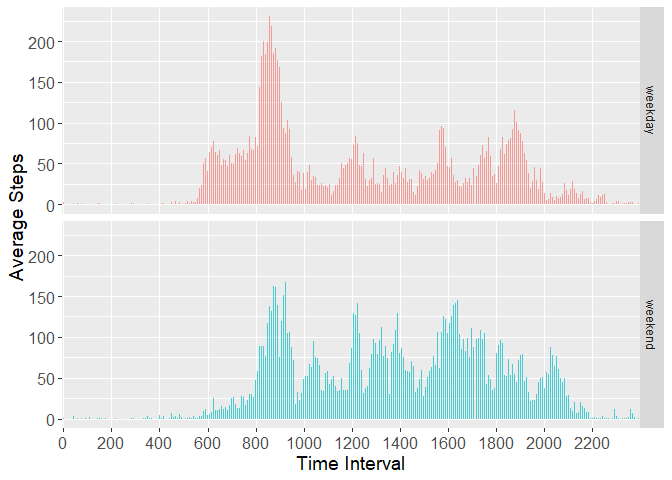

## Loading and prepocessing the data


```r
directory <- "./"
if(!("data.zip" %in% list.files(path = directory))){
    download.file(
    url = "https://d396qusza40orc.cloudfront.net/repdata%2Fdata%2Factivity.zip",
    dest=paste0(directory,"data.zip"))}
unzip("data.zip")
data<-read.csv("activity.csv")
```

## What is mean total number of steps taken per day?


```r
library(dplyr)
ndata<-data[!is.na(data)[,1],]
sumstep<-group_by(ndata,date)%>%summarize_each(funs(sum),steps)
library(ggplot2)
ggplot(sumstep, aes(steps))+
        geom_histogram(bins=5,col="black"
                    ,fill=1,alpha=0.5)+
        labs(x="Total steps per day", y="Frequency")
```

<!-- -->

```r
summary(sumstep)
```

```
##          date        steps      
##  2012-10-02: 1   Min.   :   41  
##  2012-10-03: 1   1st Qu.: 8841  
##  2012-10-04: 1   Median :10765  
##  2012-10-05: 1   Mean   :10766  
##  2012-10-06: 1   3rd Qu.:13294  
##  2012-10-07: 1   Max.   :21194  
##  (Other)   :47
```

##What is the average daily activity pattern?

```r
valstep<-group_by(ndata,interval)%>%summarize_each(funs(mean),steps)
ggplot(valstep, aes(factor(interval),steps))+
        geom_bar(stat="identity",col="black",fill=1,alpha=0.5)+
        scale_x_discrete(breaks=seq(0,2400,200))+
        labs(x="Time interval", y="Average Steps")
```

<!-- -->

```r
valstep[which.max(valstep$steps),]
```

```
## # A tibble: 1 x 2
##   interval steps
##      <int> <dbl>
## 1      835  206.
```

##Imputing missing values

```r
nadata<-data[is.na(data)[,1],]
count(nadata)
```

```
## # A tibble: 1 x 1
##       n
##   <int>
## 1  2304
```

```r
nadata<-group_by(nadata,interval)
fillin<-merge(nadata,valstep,by="interval")[-2][c(3,2,1)]
names(fillin)<- c("steps","date","interval")
newdata<-rbind(fillin,ndata)
totalstep<-group_by(newdata,date)%>%summarize_each(funs(sum),steps)
ggplot(totalstep, aes(steps))+
        geom_histogram(bins=5,col="blue"
                    ,fill="blue",alpha=0.5)+
        labs(x="Total steps per day", y="Frequency")
```

<!-- -->

```r
summary(totalstep)
```

```
##          date        steps      
##  2012-10-01: 1   Min.   :   41  
##  2012-10-02: 1   1st Qu.: 9819  
##  2012-10-03: 1   Median :10766  
##  2012-10-04: 1   Mean   :10766  
##  2012-10-05: 1   3rd Qu.:12811  
##  2012-10-06: 1   Max.   :21194  
##  (Other)   :55
```
<font size="4">The change in the mean/meidan value of the overal dataset is relatively small after replacing the NA by the mean of the correspoinding interval</font>

##Are there differences in activity patterns between weekdays and weekends?

```r
newdata$d<-ifelse(weekdays(as.Date(newdata$date)) %in% c("Saturday","Sunday"),             "weekend","weekday")
intervalstep<-group_by(newdata,interval,d)%>%summarize_each(funs(mean),steps)
ggplot(intervalstep, aes(factor(interval), steps, fill=d))+
        geom_bar(stat="identity",width=0.5,alpha=0.7)+facet_grid(d~.)+
        labs(x="Time Interval", y="Average Steps")+ guides(fill=FALSE)+
        theme(axis.title = element_text(size=14),axis.text = element_text(size=12))+scale_x_discrete(breaks=seq(0,2400,200))
```

<!-- -->

<font size="4">Looks like poeple get lazy on the weekend, they move less and get up later.</font>


